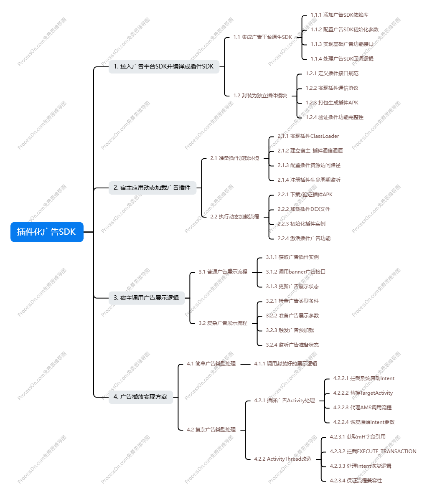

## 插件化广告SDK
### 总览
Android 接入广告SDK包含很多资源和四大组件相关的逻辑,实现成把广告SDK接入并编译成插件apk,并由宿主直接动态加载
该Demo是以vivo的广告SDK为例

> [!IMPORTANT]
>
> 问题
>
> 1. 广告SDK聚合了其他广告SDK,包含多种Activity和资源,需要处理好不同广告sdk的区别
> 2. 广告sdk除了Activity,还包含其他service、provider等四大组件,用于播放广告出发下载等逻辑，也需要处理对应的生命周期
> 3. 插件化用到反射、动态代理，存在着不同android系统版本、不同厂商rom的适配问题，目前只测试了android 10、14、15的手机
